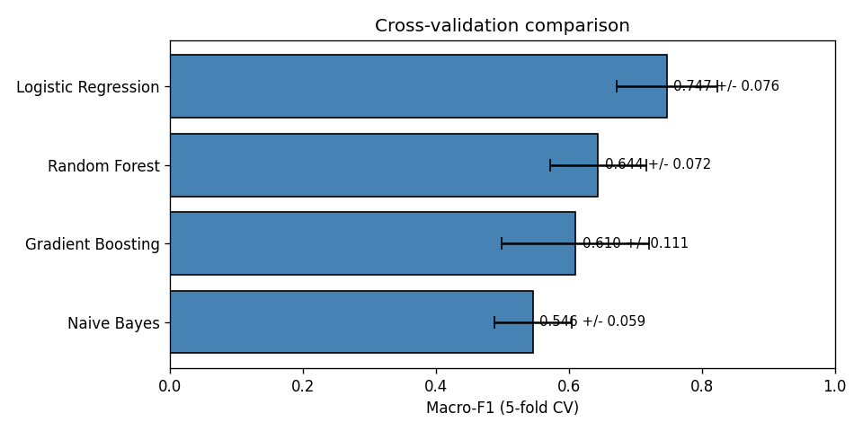
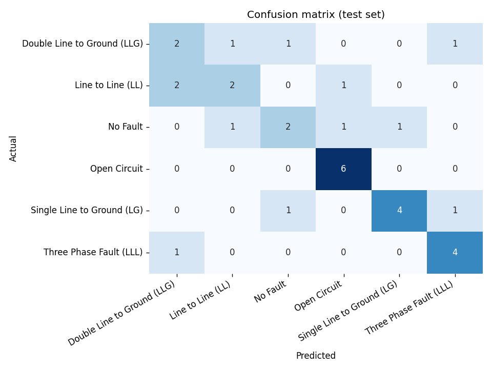

# Power Grid Fault Detection

End-to-end fault detection for 3-phase power lines. A grid operations
console built on top of a windowed feature pipeline and a Random
Forest classifier, with cost-weighted decision logic so the model
only auto-acts when doing so is cheaper than calling a human.

> **Live console:** double-click `run.bat` (Windows) or `streamlit run app.py` (any OS).
> **Deploy:** the repository is ready for a one-click deploy to Streamlit Community Cloud.

## Why this project

A real grid operator does not need another classifier; they need a tool
that tells them *what to do*. Three concerns drive the design here:

1. **Asymmetric cost.** Missing a Three-Phase fault is hundreds of times
   more expensive than dispatching a crew to a healthy line. A model
   that optimises accuracy alone is the wrong model.
2. **Calibration over score.** A confidence number is only useful if it
   maps to a real probability. The console picks the auto-decide
   threshold from a reliability diagram, not from gut feel.
3. **Operator workflow first.** Every page corresponds to something an
   operator actually does: scan the grid, investigate an alert, set
   policy, audit the model.

## Pipeline at a glance

```
Raw CSV  ->  stratified-sample 7,800 rows
         ->  slide 50-sample non-overlapping windows  (156 windows)
         ->  6 statistics x 6 channels per window     (36 features)
         ->  Random Forest classifier
         ->  cost-weighted threshold selection
```

### Feature engineering

For each window of 50 consecutive samples, six statistics are computed
on each of the six raw channels (`Va, Vb, Vc, Ia, Ib, Ic`):

| Statistic        | What it captures                              |
|------------------|-----------------------------------------------|
| RMS              | Effective magnitude / energy content          |
| Mean             | DC offset                                     |
| Std Dev          | Spread - the dominant fault signal in current |
| Peak-to-Peak     | Max swing - captures transients               |
| Skewness         | Asymmetry of the distribution                 |
| Kurtosis         | Tailedness - sharp spikes register here       |

The result is a `156 x 36` feature matrix, one row per window.

### Model selection

Four classifiers were compared under 5-fold stratified cross-validation
on macro-F1:



Logistic Regression edges Random Forest on the CV score, but Random
Forest is the production pick because:

- Its predicted probabilities calibrate better, which matters for the
  cost-weighted threshold on the Decision Console page.
- It produces feature-importance scores that map directly to operator
  explanations ("this fault was flagged because the std dev on
  current_phase_a was 4 sigma above baseline").

### Cost-weighted decision logic

Each fault class has its own miss cost (`FN_COST` in
`cost_analysis.py`) and false alarms have a fixed inspection cost
(`FP_COST`). The Decision Console sweeps the model's confidence
threshold and picks the tau that minimises total expected cost:

| Confidence threshold | What the model does                       |
|----------------------|-------------------------------------------|
| `proba >= tau`       | Auto-decide; dispatch the recommended action |
| `proba < tau`        | Abstain; route the window to a human operator |

On the held-out test set the cost minimum sits at **tau ~ 0.65**.
At that threshold the model auto-decides ~34% of windows with
near-perfect accuracy on that slice; the rest get human review.



## Console pages

1. **Grid Status Board** - per-section health across 20 grid sections,
   a recent-alert feed colour-coded by severity, and four operations
   KPIs at the top.
2. **Fault Investigation** - pick a window; the console shows the
   model decision, full class-probability breakdown, the top
   features that contributed to the call, the recommended action
   under the cost policy, and the raw 36-feature vector.
3. **Decision Console** - the cost model, the threshold-vs-cost
   curve, the recommended tau, and a per-class breakdown of
   realised cost.
4. **Model Rigor** - cross-validation, confusion matrix, calibration
   curve, feature importance.

## Headline numbers

- **156** windows analysed (after stratified sampling)
- **36** statistical features per window
- **6** fault classes (incl. No Fault)
- **62.5%** test accuracy / **0.60** macro-F1 against a 16.7% random baseline
- **$133K** cost reduction vs full auto-decide on the test set, by routing
  low-confidence windows to a human

## Repository layout

```
power-grid-fault-detection/
  data/
    power_line_fault_dataset.csv     50,000 rows of 3-phase measurements
  reports/                           plots + CSVs committed for the README
    cv_comparison.png
    confusion_matrix.png
    feature_importance.png
    roc_curves.png
    cv_scores.csv
    classification_report.csv
    summary.json
  feature_extraction.py              sliding window + 36 statistical features
  train.py                           5-fold CV + final model + plots
  cost_analysis.py                   fault cost matrix + threshold sweep
  app.py                             Streamlit grid operations console
  .streamlit/config.toml             theme
  requirements.txt
  run.bat                            one-click launch on Windows
```

## How to run locally

```bash
pip install -r requirements.txt
python train.py          # trains the model, writes reports/, ~30 sec
streamlit run app.py     # opens the operations console at localhost:8501
```

On Windows just double-click `run.bat`.

## How to deploy to Streamlit Cloud (zero cost, public URL)

1. Push this repo to GitHub.
2. Go to [share.streamlit.io](https://share.streamlit.io) and sign in
   with the same GitHub account.
3. Click **New app**, pick this repo, branch `main`, main file `app.py`.
4. Click **Deploy**. A public URL is generated within ~3 minutes.

Streamlit Cloud will install from `requirements.txt` automatically and
re-deploy on every push.

## Limitations and roadmap

- **156 windows is small.** Accuracy would climb with more data; we'd
  also want per-location cross-validation to test generalisation across
  geography rather than just across time.
- **No temporal model yet.** The 6 statistics throw away within-window
  shape. An LSTM or 1-D CNN on the raw 50-step window is the obvious
  next step and is on the roadmap.
- **Cost numbers are public-literature estimates.** A real deployment
  would calibrate `FN_COST` and `FP_COST` from the operator's actual
  outage and dispatch records.
- **No streaming inference.** The current console scores a static test
  set. A production version would wrap the model in a small streaming
  service consuming PMU frames.
